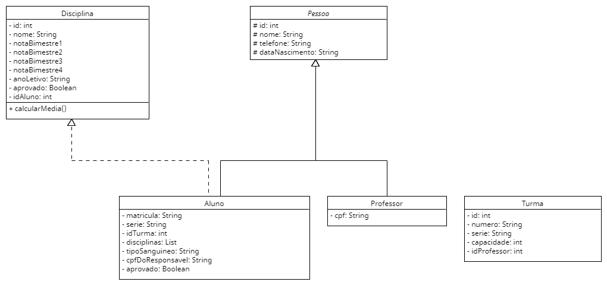
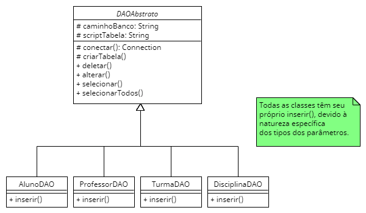
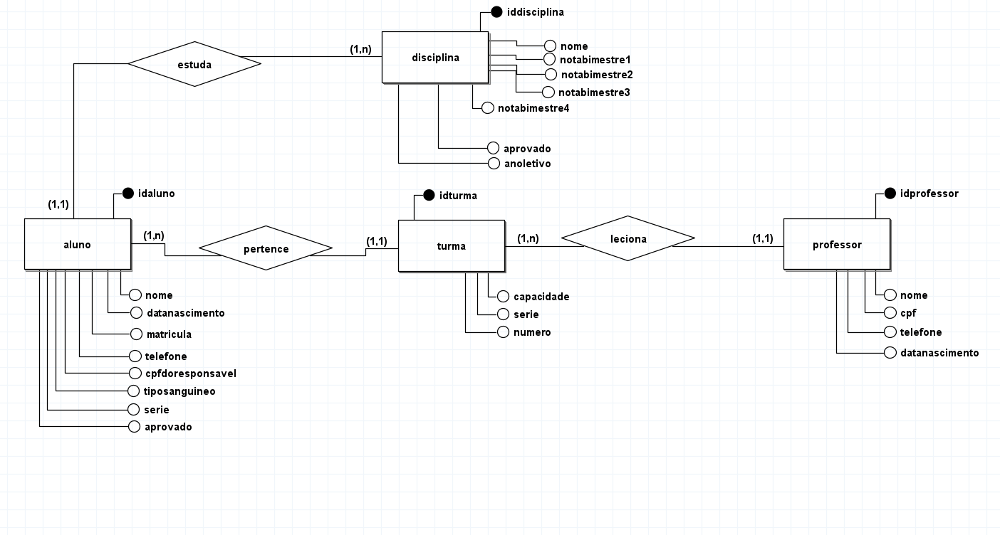
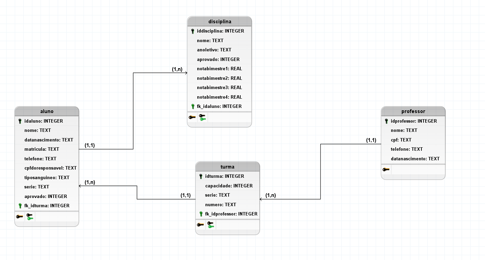

# Sistema de cadastro escolar
Trata-se de um sistema básico de cadastro de alunos para um escola implementado na linguagem Java.  
O banco de dados escolhido foi o SQLite, sendo acessado através de um driver pelo JDBC.  
Para a interface gráfica, foi escolhido o javafx.

## A fazer:
- Modificar os diagramas (Extremamente importante).
- Adicionar interface gráfica ao projeto.

## Ideias adicionais (implementadas se haver tempo antes da entrega)
- Gráfico mostrando a performance do aluno com base no histórico.
- Armazenar as presenças dos alunos.

## UML das classes básicas:

## Classes de acesso ao banco de dados:

## Diagrama de entidades e relacionamentos:

## Diagrama lógico do banco de dados:

