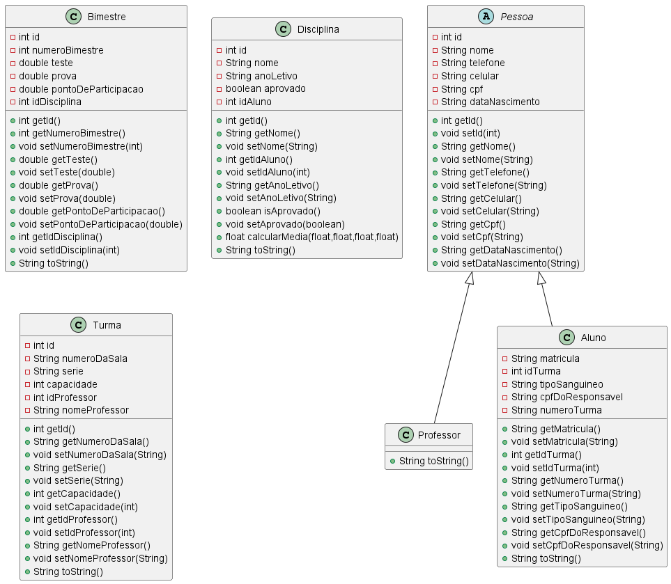
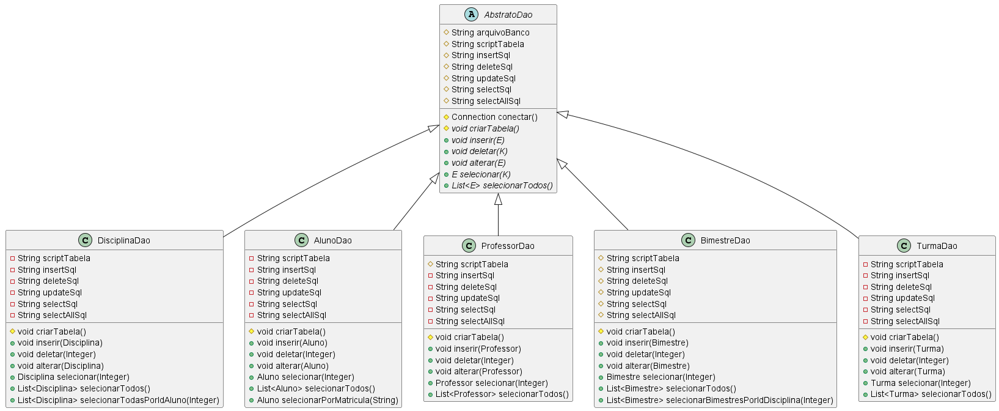
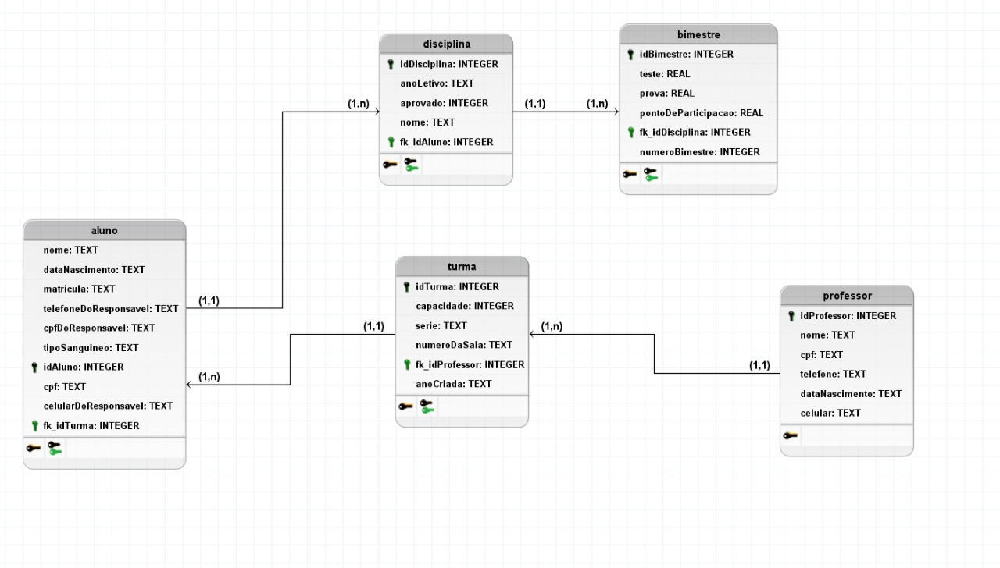

# Sistema de cadastro escolar
Trata-se de um sistema básico de cadastro de alunos para uma escola implementado na linguagem Java.  
O banco de dados escolhido foi o SQLite, sendo acessado através de um driver pelo JDBC.  
Para a interface gráfica, foi escolhido o javafx.

## UML das classes básicas:

## Classes de acesso ao banco de dados:

## Diagrama lógico do banco de dados:

